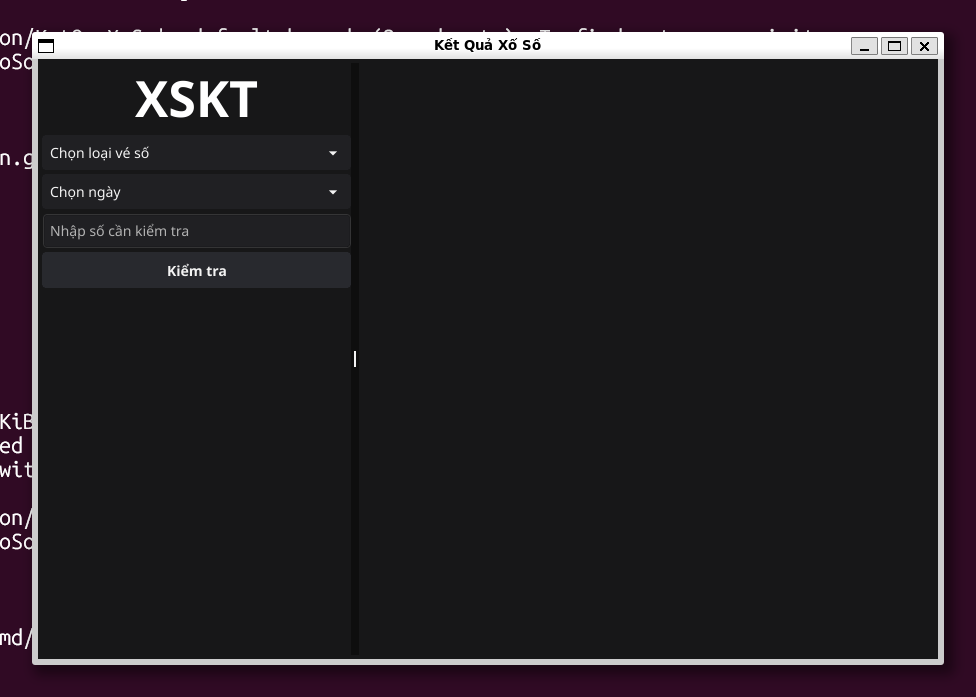
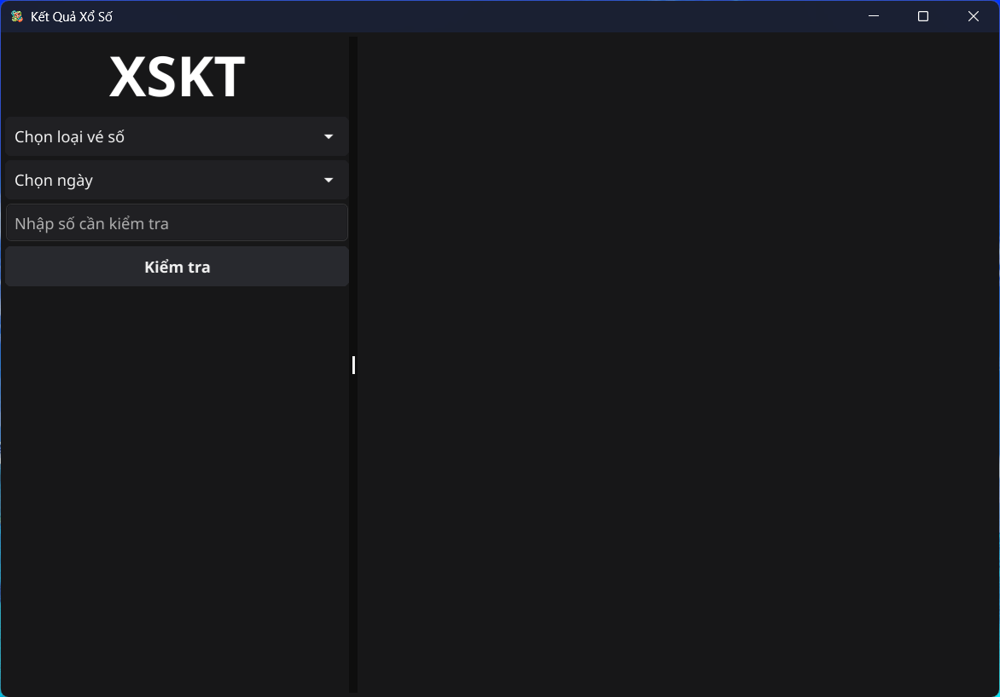
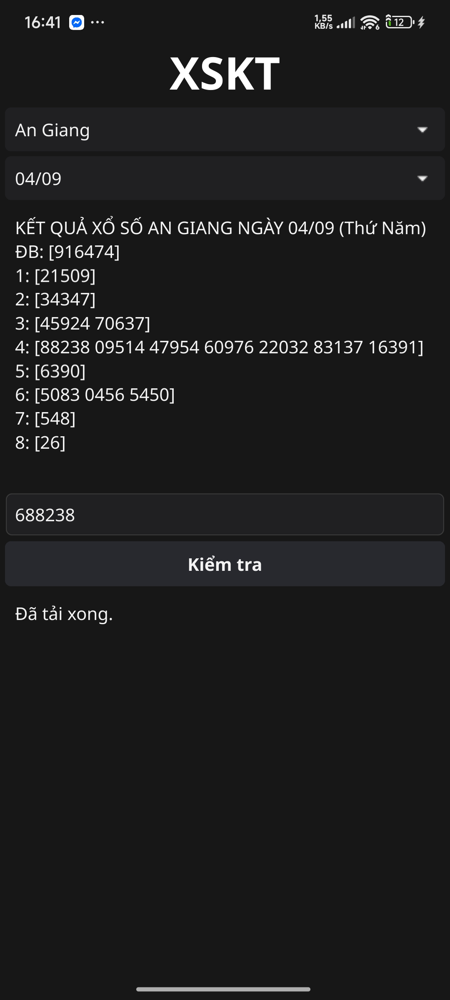

<center>

# Kết Quả Xổ Số


Chương trình xem kết quả xổ số kiến thiết Việt Nam cho Android, Linux, Windows

[](./LICENSE)
[](https://github.com/dopaemon/KetQuaXoSo/releases/latest)
[](https://github.com/dopaemon/KetQuaXoSo/releases/latest)

---

## Features

- Xem kết quả xổ số theo khu vực
- Xem kết quả xổ số theo ngày
- Chạy đa nền tảng (Android, Linux, Windows)

---

## Download

| Android | Windows | Linux |
| ------- | ------- | ----- |
| [Download APK](https://github.com/dopaemon/KetQuaXoSo/releases/latest/download/KetQuaXoSo-android-universal.apk) | [Download EXE](https://github.com/dopaemon/KetQuaXoSo/releases/latest/download/KetQuaXoSo-windows-amd64.exe) | [Download TAR.GZ](https://github.com/dopaemon/KetQuaXoSo/releases/latest/download/KetQuaXoSo.tar.gz) |
|         |         | [Download Binary](https://github.com/dopaemon/KetQuaXoSo/releases/latest/download/KetQuaXoSo-linux-amd64) |

---

## How to build
### Request
- GoLang: 1.25
- Fyne v2.6.3
- Linux server
- Cmake

### Setup enviromnet
- Get Source Code:
```bash
git clone -b main --single-branch https://github.com/dopaemon/KetQuaXoSo.git
```
- Install Packages:
```bash
sudo apt update
sudo apt-get install -y mingw-w64 build-essential pkg-config libgl1-mesa-dev xorg-dev libx11-dev gcc-aarch64-linux-gnu
```
- Install NDK: [**Google Developer**](https://developer.android.com/ndk/downloads)

### Start build
- Linux:
```bash
make linux
```
- Android:
```bash
make android
```
- Windows:
```bash
make windows
```
- Build all:
```bash
make complete
```
- OUTPUT Dir: ./out

---

## Screenshots

| Linux | Windows | Android |
| ----- | ------- | ------- |
|  |  |  |

---

## License
```MIT
The MIT License (MIT) © 2025 dopaemon <polarisdp@gmail.com>

Permission is hereby granted, free of charge, to any person obtaining a copy
of this software and associated documentation files (the "Software"), to deal
in the Software without restriction, including without limitation the rights
to use, copy, modify, merge, publish, distribute, sublicense, and/or sell
copies of the Software, and to permit persons to whom the Software is
furnished to do so, subject to the following conditions:

The above copyright notice and this permission notice shall be included in all
copies or substantial portions of the Software.

THE SOFTWARE IS PROVIDED "AS IS", WITHOUT WARRANTY OF ANY KIND, EXPRESS OR
IMPLIED, INCLUDING BUT NOT LIMITED TO THE WARRANTIES OF MERCHANTABILITY,
FITNESS FOR A PARTICULAR PURPOSE AND NONINFRINGEMENT. IN NO EVENT SHALL THE
AUTHORS OR COPYRIGHT HOLDERS BE LIABLE FOR ANY CLAIM, DAMAGES OR OTHER
LIABILITY, WHETHER IN AN ACTION OF CONTRACT, TORT OR OTHERWISE, ARISING FROM,
OUT OF OR IN CONNECTION WITH THE SOFTWARE OR THE USE OR OTHER DEALINGS IN THE
SOFTWARE.
```
</center>
